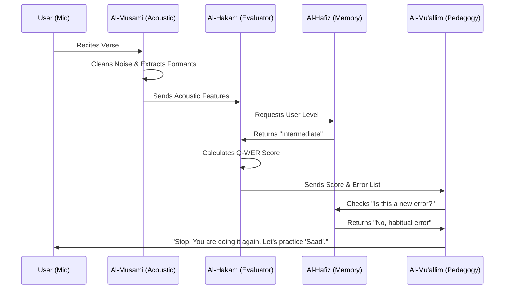

# 🤖 Quran Pulse: Multi-Agent System (MAS) Architecture

This document defines the personas, responsibilities, and interaction protocols for the autonomous agents within the Quran Pulse system.

The system operates as a **Squad of 4 Specialists**, orchestrated to deliver acoustic-first Quran education.

---

## 1. The Acoustic Agent (Code Name: *Al-Musami'*)
**Role:** The "Ears" (Signal Processing Specialist)
**Location:** `core_engine/acoustic/` & `preprocessing/`

### 📝 Responsibilities
* **Noise Gating:** Detects and suppresses non-vocal noise specific to Malaysian environments (ceiling fans, air-conditioning hum) using `preprocessing/noise_robustness.py`.
* **Feature Extraction:** Extracts raw physics data:
    * **Formants (F1/F2):** To distinguish vowel quality (e.g., 'Fatha' vs 'Imalah').
    * **Pitch Contour:** To measure *Madd* duration and *Ghunnah* vibration.
    * **Zero-Crossing Rate:** To detect *Hams* (breathiness) in letters like 'Ta' and 'Kaf'.
* **Malaysian Calibration:** Applies a specific offset to formant analysis to account for Nusantara accent (e.g., tolerating a slightly heavier 'Ra' based on local dialect norms).

### 🛠️ Tools & Models
* **Tech:** Librosa, PyTorch, Wav2Vec2 (Malaysian Adapter).
* **Output:** `AcousticFeatureVector` (JSON).

---

## 2. The Evaluation Agent (Code Name: *Al-Hakam*)
**Role:** The "Judge" (Scoring Logic)
**Location:** `intelligence/metrics/`

### 📝 Responsibilities
* **Q-WER Calculation:** Computes the *Quran Weighted Error Rate* using the project's theological weighting system.
* **Error Classification:** Categorizes mistakes into:
    * **Makhraj (3.0x):** Articulation point errors (Critical).
    * **Tajweed (2.5x):** Rule violations (Ghunnah, Qalqalah).
    * **Harakat (2.0x):** Vowel timing errors.
    * **Rhythm (1.0x):** Fluency issues.
* **Severity Analysis:** Determines if an error is *Lahnan Jaliyy* (Clear Error - changes meaning) or *Lahnan Khafiyy* (Hidden Error).

### 🧠 Logic
* **Adaptive Scoring:**
    * IF `UserLevel == Beginner`: Rhythm penalty is reduced by 50%.
    * IF `UserLevel == Advanced`: Precision tolerance is tightened by 20%.

---

## 3. The Profiling Agent (Code Name: *Al-Hafiz*)
**Role:** The "Memory" (Long-term Storage)
**Location:** `intelligence/memory/`

### 📝 Responsibilities
* **History Tracking:** maintain a ledger of every phoneme ever pronounced by the user.
* **Trend Analysis:** Identifies persistent bad habits (e.g., "User consistently fails 'Ra' Tafkhim when it appears after a Kasrah").
* **Level Progression:** Decides when a user graduates from Beginner to Intermediate.

### 🛠️ Tools
* **Storage:** Vector Database / JSON Store.
* **Metric:** "Mastery Index" per Tajweed rule.

---

## 4. The Pedagogy Agent (Code Name: *Al-Mu'allim*)
**Role:** The "Teacher" (Strategy & Feedback)
**Location:** `intelligence/pedagogy/` & `agent/policy.ts`

### 📝 Responsibilities
* **Lesson Planning:** Decides the immediate next step.
    * *Scenario A:* Error > 3 times? -> **Trigger Micro-Drill**.
    * *Scenario B:* High Accuracy? -> **Trigger Flow Mode (Next Verse)**.
* **Feedback Translation:** Converts raw data (e.g., "F1 freq too low") into human instructions (e.g., "Open your mouth vertically for Fatha").
* **Tone Management:** Adjusts feedback style (Encouraging vs Strict) based on the user's recent performance trend.

---

## 🔄 Interaction Diagram (The Loop)



---

## 🎯 Agent Communication Protocol

### Message Format
All agents communicate using standardized JSON messages:

```json
{
  "timestamp": "2024-01-15T10:30:00Z",
  "source_agent": "Al-Musami",
  "target_agent": "Al-Hakam",
  "message_type": "acoustic_features",
  "payload": {
    "audio_id": "rec_001_20240115",
    "features": {
      "formants": {"F1": 550, "F2": 1850},
      "pitch": 120.5,
      "duration": 0.8,
      "tajwid_rule": "madd_3"
    },
    "metadata": {
      "confidence": 0.92,
      "processing_time": 0.15
    }
  }
}
```

### Error Handling
- **Graceful Degradation:** If any agent fails, others continue with cached/estimated data
- **Fallback Mechanisms:** 
  - If `Al-Hakam` fails → Use previous Q-WER score
  - If `Al-Hafiz` fails → Treat as new user
  - If `Al-Mu'allim` fails → Provide generic feedback

---

## 📊 Performance Metrics

### Individual Agent KPIs
- **Al-Musami:** Noise reduction ratio > 20dB, Processing latency < 200ms
- **Al-Hakam:** Q-WER accuracy > 90%, Error classification precision > 85%
- **Al-Hafiz:** Memory retrieval latency < 50ms, Storage efficiency > 95%
- **Al-Mu'allim:** Feedback relevance score > 4.0/5.0, User engagement > 80%

### System-Level Metrics
- **Overall Q-WER Improvement:** Target 15% improvement per session
- **Response Time:** End-to-end feedback < 1.5 seconds
- **User Retention:** > 70% weekly active users

---

## 🛡️ Security & Privacy

### Data Protection
- **Audio Encryption:** All audio data encrypted at rest and in transit
- **Anonymization:** User profiles de-identified for analysis
- **Local Processing:** Sensitive audio processed on-device when possible

### Islamic Compliance
- **Content Integrity:** All feedback aligned with Hafs 'an 'Asim riwayah
- **Respectful Interaction:** Feedback maintains Islamic etiquette and respect
- **Cultural Sensitivity:** Adapted for Malaysian Islamic educational context

---

## 🚀 Deployment Architecture

### Microservices Design
Each agent runs as an independent service:
- **Containerized:** Docker containers for each agent
- **Orchestrated:** Kubernetes for scaling and management
- **API Gateway:** Single entry point for external requests
- **Message Queue:** RabbitMQ/Redis for inter-agent communication

### Scalability
- **Horizontal Scaling:** Add agent instances based on load
- **Load Balancing:** Distribute requests across agent instances
- **Caching Layer:** Redis for frequently accessed user data

This multi-agent architecture ensures robust, scalable, and culturally-appropriate Quranic education delivery.