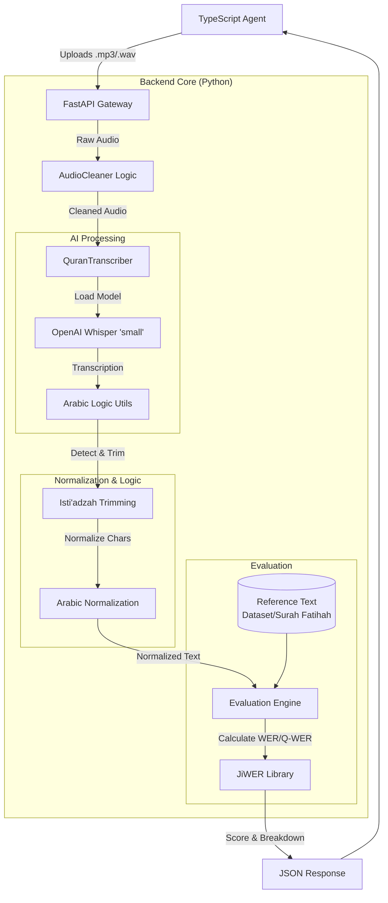

# System Architecture - Quran Pulse (Phase 1)

This diagram outlines the current verified architecture of the Quran Pulse Agent, detailing the data flow from the Client Agent to the AI Core and Evaluation Engine.

## Data Flow Description

1. **Client Layer:** The **TypeScript Agent** (specifically `agent/bridge.ts`) reads the local audio file (`.mp3` or `.wav`) and streams it via a POST request to the API.
2. **API Gateway:** **FastAPI** (`main.py`) receives the `multipart/form-data` request, validates the file type, and saves it temporarily.
3. **Preprocessing:** The `AudioCleaner` (in `preprocessing/noise_robustness.py`) performs initial signal processing to prepare the audio for the model.
4. **AI Core:**
    * The `QuranTranscriber` (`models/transcriber.py`) invokes the **OpenAI Whisper ('small')** model.
    * It converts the audio pulses into raw Arabic text.
5. **Smart Logic & Normalization:**
    * The raw text is passed to `preprocessing/arabic_utils.py`.
    * **Isti'adzah Trimming:** It detects if the user said "A'udhu billah..." and removes it to align the start with the Quranic text (Bismillah).
    * **Normalization:** It strips diacritics (Tashkeel) and unifies Alef characters (`أ`, `إ`, `آ` → `ا`) to ensure fair comparison.
6. **Evaluation Engine:**
    * The system loads the "Ground Truth" text from `dataset/surah_fatihah.txt`.
    * It uses `jiwer` to calculate the **Word Error Rate (WER)**.
    * This is converted into a **Q-WER Score** (Quality Weighted Error Rate) to represent Tajweed accuracy.
7. **Response:** A detailed JSON object containing the Score, Level (Beginner/Intermediate), and Error Breakdown is returned to the client.
