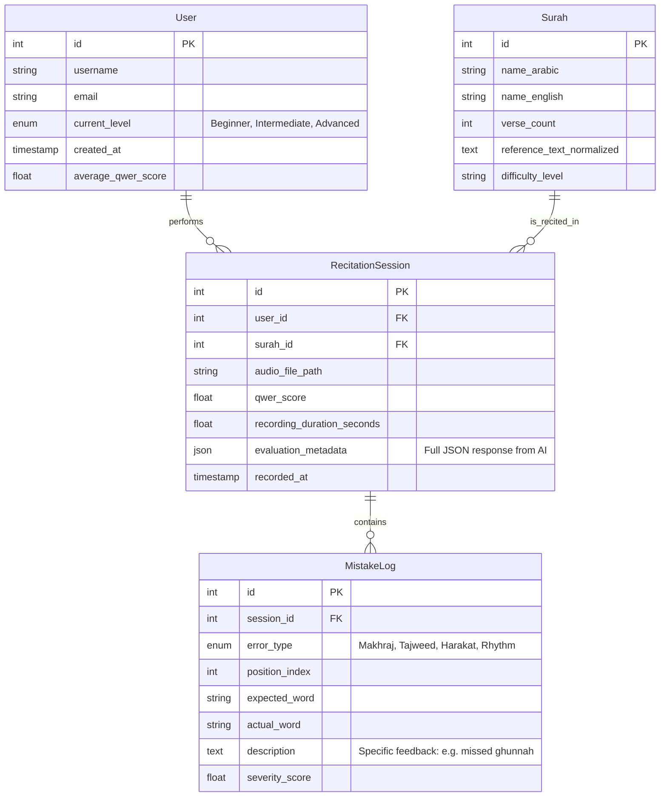

# Entity Relationship Diagram (ERD) - Phase 2 Database

This document outlines the planned database schema for Phase 2, designed to persist user progress, recitation sessions, and detailed error logs.

## Schema Explanation

### 1. User

Represents the student. Tracks their overall proficiency level (`current_level`) and improvement over time.

### 2. Surah

Acts as the central "Reference Table".

* `reference_text_normalized`: Stores the pre-normalized text (Tashkeel removed) for faster runtime comparison.
* `difficulty_level`: Helps the Agent suggest appropriate Surahs for the user (e.g., Fatihah = Easy, Al-Baqarah = Hard).

### 3. RecitationSession

The core transaction table. Every time a user submits an audio file, a record is created here.

* `audio_file_path`: Link to the stored .mp3/.wav file (for future playback/review).
* `qwer_score`: The high-level accuracy score.
* `evaluation_metadata`: Stores the full raw JSON output from the AI for deep debugging without complex joins.

### 4. MistakeLog

A granular table for analytics.

* Allows us to query questions like: *"Which letter does User X fail at the most?"* or *"What is the most common mistake in Surah Al-Fatihah?"*
* `error_type`: Categorizes the implementation (Phonetic vs Rule-based).
