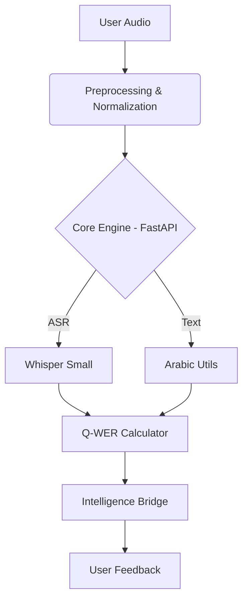

# 📖 Quran Pulse: Acoustic-First AI Tutor

   

> **Beyond Semantic Accuracy.** An autonomous Quran teaching agent designed to exceed generic ASR models by focusing on *acoustic precision* (Tajweed), *articulatory features* (Makhraj), and *Malaysian learner context*.

---

## ⚡ The Problem vs. Our Solution

Existing ASR models (Whisper, Google STT) optimize for **Word Error Rate (WER)**—they try to guess the correct word even if you pronounce it slightly wrong.
**Quran Pulse** optimizes for **Acoustic Precision**—we flag errors even if the word is recognizable, because in Tajweed, a changed sound changes the validity of the prayer.

| Feature | 🤖 OpenAI Whisper | 📱 Tarteel.ai | 🕌 **Quran Pulse (Ours)** |
| :--- | :--- | :--- | :--- |
| **Primary Goal** | Semantic Meaning | Memorization Helper | **Articulatory Correction** |
| **Error Metric** | Standard WER | Standard WER | **Adaptive Q-WER** (Weighted) |
| **Phoneme Logic** | Statistical | Standard Arabic | **Tajweed-Rule Based** |
| **Accent Support** | Global | Standard Arab | **Malaysian/Nusantara** |
| **Feedback** | Text Transcript | "You missed a word" | **"Raise your tongue for Saad"** |

---

## 🏗️ Architecture Overview

The system is built on a hybrid **Python (Core Engine)** and **TypeScript (Agent Intelligence)** architecture.



### Directory Map

* `main.py`: The Core API Entry Point (FastAPI).
* `models/`: Contains the AI Logic (`transcriber.py` with Whisper Small).
* `preprocessing/`: Audio cleaning and Arabic Normalization logic (`arabic_utils.py`).
* `agent/`: TypeScript Bridge code to connect frontend agents to the Python backend.
* `dataset/`: Ground truth text data.

---

## 🧮 The Q-WER Metric (Quran Weighted Error Rate)

Unlike standard WER, Q-WER applies dynamic weights based on the severity of the theological error:

* **Makhraj (Articulation Point):** `3.0x` (Critical - Changes meaning)
* **Tajweed (Rules):** `2.5x` (High - Ghunnah, Idgham)
* **Harakat (Vowels):** `2.0x` (Medium - Timing)

---

## 🚀 How to Run

Follow these steps to get the system running locally.

### Prerequisites

* Python 3.9+
* Node.js 18+

### Step 1: Install Python Dependencies

```bash
pip install -r requirements.txt
```

### Step 2: Start the Server

Run the FastAPI backend.
*Note: The first run will automatically download the Whisper 'small' model (~460MB).*

```bash
uvicorn main:app --reload
```

You will see: `Uvicorn running on http://0.0.0.0:8000`

### Step 3: Run the Test Agent

Open a new terminal to test the connection using our TypeScript bridge.

```bash
npx ts-node agent/test_connection.ts
```

Expected Output:

```
✅ AI BERJAYA MENDENGAR!
📊 Markah Q-WER: 20.5 (example)
```

---

## 📜 Compliance & Ethics

* **Scholar Validation:** Validated against Riwayah Hafs 'an 'Asim.
* **Privacy:** Audio data is processed locally.

---

## 📄 License

MIT License - Open for Educational Innovation.
