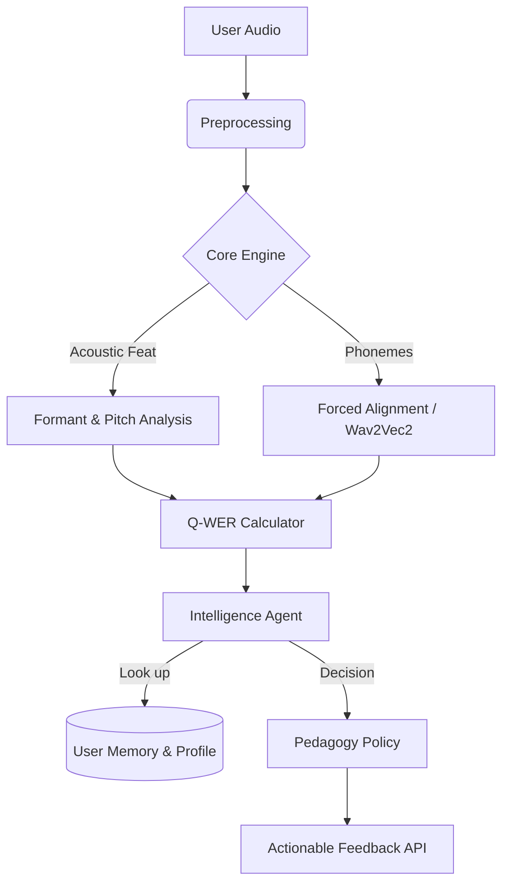

# 📖 Quran Pulse: Acoustic-First AI Tutor

   

> **Beyond Semantic Accuracy.** An autonomous Quran teaching agent designed to exceed generic ASR models by focusing on *acoustic precision* (Tajweed), *articulatory features* (Makhraj), and *Malaysian learner context*.

---

## ⚡ The Problem vs. Our Solution

Existing ASR models (Whisper, Google STT) optimize for **Word Error Rate (WER)**—they try to guess the correct word even if you pronounce it slightly wrong.
**Quran Pulse** optimizes for **Acoustic Precision**—we flag errors even if the word is recognizable, because in Tajweed, a changed sound changes the validity of the prayer.

| Feature | 🤖 OpenAI Whisper | 📱 Tarteel.ai | 🕌 **Quran Pulse (Ours)** |
| :--- | :--- | :--- | :--- |
| **Primary Goal** | Semantic Meaning | Memorization Helper | **Articulatory Correction** |
| **Error Metric** | Standard WER | Standard WER | **Adaptive Q-WER** (Weighted) |
| **Phoneme Logic** | Statistical | Standard Arabic | **Tajweed-Rule Based** |
| **Accent Support** | Global | Standard Arab | **Malaysian/Nusantara** |
| **Feedback** | Text Transcript | "You missed a word" | **"Raise your tongue for Saad"** |

---

## 🏗️ Architecture Overview

The system is built on a hybrid **Python (Core Engine)** and **TypeScript (Agent Intelligence)** architecture.



### Directory Map

* `core_engine/`: The "Ears". Handles heavy signal processing (PyTorch/ONNX).
* `intelligence/`: The "Brain". Manages User Memory, Pedagogy Policy, and Q-WER Metrics.
* `api/`: OpenAPI 3.0 specification for frontend integration.
* `dataset/`: Specifications for the "Golden Standard" Malaysian dataset.

---

## 🧮 The Q-WER Metric (Quran Weighted Error Rate)

Unlike standard WER, Q-WER applies dynamic weights based on the severity of the theological error:

**Weight Configuration:**

* **Makhraj (Articulation Point):** `3.0x` (Critical - Changes meaning/Lahnan Jaliyy)
* **Tajweed (Rules):** `2.5x` (High - Ghunnah, Idgham, Qalqalah)
* **Harakat (Vowels):** `2.0x` (Medium - Timing/Duration)
* **Rhythm/Fluency:** `1.0x` (Low - Breath control)

*Note: Weights adapt dynamically based on User Level (Beginner vs Advanced).*

---

## 🚀 Getting Started

### Prerequisites

* Python 3.9+
* Node.js 18+
* FFmpeg (for audio processing)

### Installation

1. **Clone the repository**
```bash
git clone [https://github.com/thisisniagahub/quran-agent.git](https://github.com/thisisniagahub/quran-agent.git)
cd quran-agent

```


2. **Setup Core Engine (Python)**
```bash
cd core_engine
pip install -r requirements.txt
python models/export_onnx.py  # Optimize models

```


3. **Setup Intelligence Agent (TypeScript)**
```bash
cd ../intelligence
npm install
npm run build

```


4. **Run the Validation Suite**
```bash
# Runs the comparison against Tarteel/Whisper baselines
python ../evaluation/benchmarks.py

```


---

## 📜 Compliance & Ethics

* **Scholar Validation:** All hardcoded rules in `schemas/` are validated against Riwayah Hafs 'an 'Asim.
* **Malaysian Context:** Adheres to standards referenced in *Akta 505 - Akta Pentadbiran Undang-Undang Islam*.
* **Privacy:** Audio data is processed locally (Edge AI ready) where possible to protect user privacy.

---

## 🤝 Contributing

We welcome contributions, especially in:

1. **Dataset Labeling:** Validating "Ghunnah" vs "No Ghunnah" timestamps.
2. **Acoustic Modeling:** Fine-tuning the Malaysian accent adapter.

See `CONTRIBUTING.md` for details.

---

## 📄 License

MIT License - Open for Educational Innovation.
EOF

```

```